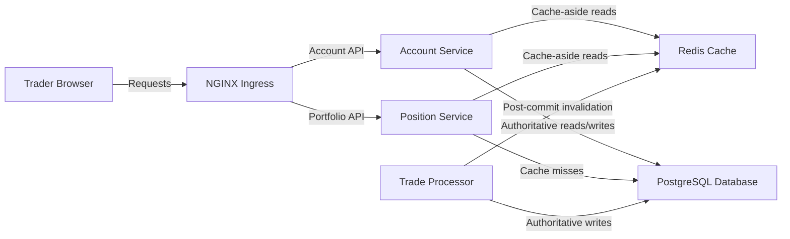

# Architecture (State 016 Redis Database Cache)

State 016 adds cache-aside reads and post-commit invalidation while PostgreSQL remains authoritative.

- Inherits architectural baseline from: `005-postgres-database-replacement`
- Generated from: `system/architecture.model.json`
- Canonical flows: `../../001-baseline-uncontainerized-parity/system/end-to-end-flows.md`

## Entry Points

- `ingress`: `http://localhost:8080`

## Architecture Diagram

## Node Catalog

| Node | Kind | Label | Notes |
| --- | --- | --- | --- |
| `trader` | actor | Trader Browser | Uses TraderX through ingress. |
| `ingress` | gateway | NGINX Ingress | Single browser entrypoint. |
| `account` | service | Account Service | Caches account and account-user reads. |
| `position` | service | Position Service | Caches trade and position reads. |
| `tradeProcessor` | service | Trade Processor | Persists trades and invalidates affected caches after commit. |
| `redis` | cache | Redis Cache | Shared, time-bounded read cache. |
| `database` | database | PostgreSQL Database | Authoritative account, trade, and position store. |

## State Notes

- Cache behavior is opt-in and state-local.
- Writes always target PostgreSQL.
- Default cache lifetime is 30 seconds.

